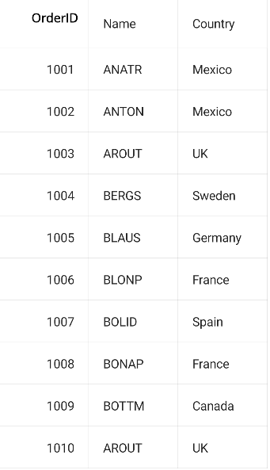

# how-to-bind-a-property-of-the-view-model-in-the-header-template-in-maui-datagrid

The .NET [MAUI DataGrid](https://www.syncfusion.com/maui-controls/maui-datagrid)(SfDataGrid) allows you to load [HeaderTemplate](https://help.syncfusion.com/cr/maui/Syncfusion.Maui.DataGrid.DataGridColumn.html#Syncfusion_Maui_DataGrid_DataGridColumn_HeaderTemplate) for a [GridColumn](https://help.syncfusion.com/cr/maui/Syncfusion.Maui.DataGrid.DataGridColumn.html) to load a customized view of choice. You can bind a property in the ViewModel to a view inside the [HeaderTemplate](https://help.syncfusion.com/cr/maui/Syncfusion.Maui.DataGrid.DataGridColumn.html#Syncfusion_Maui_DataGrid_DataGridColumn_HeaderTemplate) and set its BindingContext to be the reference of ViewModel to get it working.

## C#
Create the HeaderText property in ViewModel class.

```C#
public class ViewModel : INotifyPropertyChanged
    {
        private ObservableCollection<OrderInfo> orderInfo;
        private ICommand buttonCommand;
        public ObservableCollection<OrderInfo> OrderInfoCollection
        {
            get { return orderInfo; }
            set { this.orderInfo = value; RaisePropertyChanged("OrderInfoCollection"); }
        }

        public string HeaderText { get; set; }
        public ICommand ButtonCommand
        {
            get { return buttonCommand; }
            set { buttonCommand = value; }
        }

        public ViewModel()
        {
            this.HeaderText = "OrderID";
            this.OrderInfoCollection = new ObservableCollection<OrderInfo>();
            this.GenerateOrders();
        }

        public void GenerateOrders()
        {
            this.OrderInfoCollection.Add(new OrderInfo(1001, "Ana Trujillo", "Mexico", "ANATR"));
            this.OrderInfoCollection.Add(new OrderInfo(1002, "Ant Fuller", "Mexico", "ANTON"));
            this.OrderInfoCollection.Add(new OrderInfo(1003, "Thomas Hardy", "UK", "AROUT"));
            this.OrderInfoCollection.Add(new OrderInfo(1004, "Tim Adams", "Sweden", "BERGS"));
            this.OrderInfoCollection.Add(new OrderInfo(1005, "Hanna Moos", "Germany", "BLAUS"));
            this.OrderInfoCollection.Add(new OrderInfo(1006, "Andrew Fuller", "France", "BLONP"));
            this.OrderInfoCollection.Add(new OrderInfo(1007, "Martin King", "Spain", "BOLID"));
            this.OrderInfoCollection.Add(new OrderInfo(1008, "Lenny Lin", "France", "BONAP"));
            this.OrderInfoCollection.Add(new OrderInfo(1009, "John Carter", "Canada", "BOTTM"));
            this.OrderInfoCollection.Add(new OrderInfo(1010, "Laura King", "UK", "AROUT"));
        }

        #region INotifyPropertyChanged

        public event PropertyChangedEventHandler PropertyChanged;

        private void RaisePropertyChanged(string name)
        {
            if (PropertyChanged != null)
                this.PropertyChanged(this, new PropertyChangedEventArgs(name));
        }

        #endregion
    }
```

## XAML
Bind the value of ViewModel.HeaderText property to Text property of Label.

```XML
<ContentPage xmlns="http://schemas.microsoft.com/dotnet/2021/maui"
             xmlns:x="http://schemas.microsoft.com/winfx/2009/xaml"
             xmlns:local="clr-namespace:DataGridMAUI"
             xmlns:syncfusion="clr-namespace:Syncfusion.Maui.DataGrid;assembly=Syncfusion.Maui.DataGrid"
             x:Class="DataGridMAUI.MainPage">
    <ContentPage.BindingContext>
        <local:ViewModel x:Name="ViewModel"></local:ViewModel>
    </ContentPage.BindingContext>
    <syncfusion:SfDataGrid x:Name="dataGrid" AutoGenerateColumnsMode="None" GridLinesVisibility="Both" HeaderGridLinesVisibility="Both" VerticalOptions="FillAndExpand" ItemsSource="{Binding OrderInfoCollection}" >
        <syncfusion:SfDataGrid.Columns>
            <syncfusion:DataGridNumericColumn MappingName="OrderID" Format="D">
                <syncfusion:DataGridNumericColumn.HeaderTemplate>
                    <DataTemplate>
                        <StackLayout>
                            <Label BindingContext="{x:Reference ViewModel}" 
             Text="{Binding HeaderText}" FontAttributes="Bold" VerticalOptions="Center" Padding="12" HorizontalOptions="End"
             TextColor="Black"
             />
                        </StackLayout>
                    </DataTemplate>
                </syncfusion:DataGridNumericColumn.HeaderTemplate>
            </syncfusion:DataGridNumericColumn>
            <syncfusion:DataGridTextColumn MappingName="Customer" HeaderText="Name"></syncfusion:DataGridTextColumn>
            <syncfusion:DataGridTextColumn MappingName="Country"></syncfusion:DataGridTextColumn>
        </syncfusion:SfDataGrid.Columns>
    </syncfusion:SfDataGrid>
</ContentPage>
```


